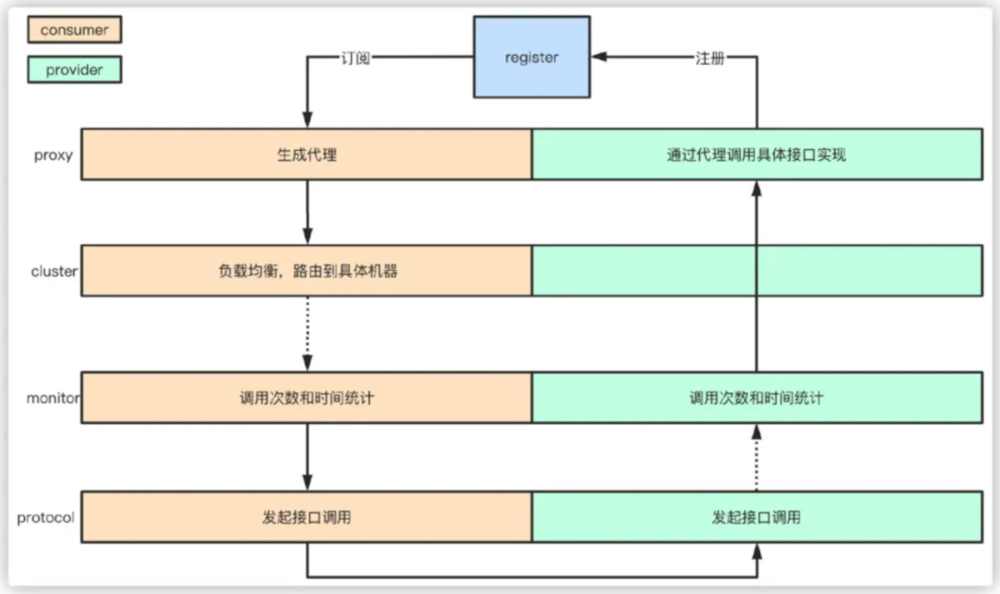

= 知识整理

== JDK

== JVM

== MYSQL

=== 脏读、幻读、不可重复读
. 脏读 脏读即为事务1第二次读取时,读到了事务2未提交的数据。若事务2回滚,则事务1第二次读取时,读到了脏数据。 脏读
. 不可重复读 不可重复读与脏读逻辑类似。主要在于事务2在事务1第二次读取时,提交了数据。导致事务1前后两次读取的数据不一致。 不可...
. 幻读 事务1第二次查询时,读到了事务2提交的数据。 幻读
. 不可重复读与幻读的区别 不可重复读针对的是值的不同,幻读指的是数据条数的不同。 隔离级别

=== S锁、X锁、意向锁、间隙锁

S锁：

=== 如何把系统不停机迁移到分库分表
简单来说，就是在线上系统里面，之前所有写库的地方，增删改操作，都除了对老库增删改，都加上对新库的增删改，这就是所谓双写，同时写俩库，老库和新库。

然后系统部署之后，新库数据差太远，用之前说的导数工具，跑起来读老库数据写新库，写的时候要根据gmt_modified这类字段判断这条数据最后修改的时间，除非是读出来的数据在新库里没有，或者是比新库的数据新才会写。

接着导万一轮之后，有可能数据还是存在不一致，那么就程序自动做一轮校验，比对新老库每个表的每条数据，接着如果有不一样的，就针对那些不一样的，从老库读数据再次写。反复循环，直到两个库每个表的数据都完全一致为止。

接着当数据完全一致了，就ok了，基于仅仅使用分库分表的最新代码，重新部署一次，不就仅仅基于分库分表在操作了么，还没有几个小时的停机时间，很稳。所以现在基本玩儿数据迁移之类的，都是这么干了。

=== 动态扩容的分库分表方案

1、设定好几台数据库服务器，每台服务器上几个库，每个库多少个表，推荐是32库 * 32表，对于大部分公司来说，可能几年都够了

2、路由的规则，orderId 模 32 = 库，orderId / 32 模 32 = 表

3、扩容的时候，申请增加更多的数据库服务器，装好mysql，倍数扩容，4台服务器，扩到8台服务器，16台服务器

4、由dba负责将原先数据库服务器的库，迁移到新的数据库服务器上去，很多工具，库迁移，比较便捷

5、我们这边就是修改一下配置，调整迁移的库所在数据库服务器的地址

6、重新发布系统，上线，原先的路由规则变都不用变，直接可以基于2倍的数据库服务器的资源，继续进行线上系统的提供服务

=== 分布式主键生成

* snowflake算法

twitter开源的分布式id生成算法，就是把一个64位的long型的id，1个bit是不用的，用其中的41 bit作为毫秒数，用10 bit作为工作机器id，12 bit作为序列号

1 bit：不用，为啥呢？因为二进制里第一个bit为如果是1，那么都是负数，但是我们生成的id都是正数，所以第一个bit统一都是0

41 bit：表示的是时间戳，单位是毫秒。41 bit可以表示的数字多达2^41 - 1，也就是可以标识2 ^ 41 - 1个毫秒值，换算成年就是表示69年的时间。

10 bit：记录工作机器id，代表的是这个服务最多可以部署在2^10台机器上哪，也就是1024台机器。但是10 bit里5个bit代表机房id，5个bit代表机器id。意思就是最多代表2 ^ 5个机房（32个机房），每个机房里可以代表2 ^ 5个机器（32台机器）。

12 bit：这个是用来记录同一个毫秒内产生的不同id，12 bit可以代表的最大正整数是2 ^ 12 - 1 = 4096，也就是说可以用这个12bit代表的数字来区分同一个毫秒内的4096个不同的id

64位的long型的id，64位的long -> 二进制

0 | 0001100 10100010 10111110 10001001 01011100 00 | 1 0001 | 1 1001 | 0000 00000000

2018-01-01 10:00:00 -> 做了一些计算，再换算成一个二进制，41bit来放 -> 0001100 10100010 10111110 10001001 01011100 00

机房id，17 -> 换算成一个二进制 -> 10001

机器id，25 -> 换算成一个二进制 -> 11001

=== mysql主从复制

==== 如何实现mysql的读写分离

其实很简单，就是基于主从复制架构，简单来说，就搞一个主库，挂多个从库，然后我们就单单只是写主库，然后主库会自动把数据给同步到从库上去。

==== MySQL主从复制原理

主库将变更写binlog日志，然后从库连接到主库之后，从库有一个IO线程，将主库的binlog日志拷贝到自己本地，写入一个中继日志中。接着从库中有一个SQL线程会从中继日志读取binlog，然后执行binlog日志中的内容，也就是在自己本地再次执行一遍SQL，这样就可以保证自己跟主库的数据是一样的。

这里有一个非常重要的一点，就是从库同步主库数据的过程是串行化的，也就是说主库上并行的操作，在从库上会串行执行。所以这就是一个非常重要的点了，由于从库从主库拷贝日志以及串行执行SQL的特点，在高并发场景下，从库的数据一定会比主库慢一些，是有延时的。所以经常出现，刚写入主库的数据可能是读不到的，要过几十毫秒，甚至几百毫秒才能读取到。

而且这里还有另外一个问题，就是如果主库突然宕机，然后恰好数据还没同步到从库，那么有些数据可能在从库上是没有的，有些数据可能就丢失了。

所以mysql实际上在这一块有两个机制，一个是半同步复制，用来解决主库数据丢失问题；一个是并行复制，用来解决主从同步延时问题。

这个所谓半同步复制，semi-sync复制，指的就是主库写入binlog日志之后，就会将强制此时立即将数据同步到从库，从库将日志写入自己本地的relay log之后，接着会返回一个ack给主库，主库接收到至少一个从库的ack之后才会认为写操作完成了。

所谓并行复制，指的是从库开启多个线程，并行读取relay log中不同库的日志，然后并行重放不同库的日志，这是库级别的并行。 1）主从复制的原理 2）主从延迟问题产生的原因 3）主从复制的数据丢失问题，以及半同步复制的原理 4）并行复制的原理，多库并发重放relay日志，缓解主从延迟问题

==== mysql主从同步延时问题（精华）

线上确实处理过因为主从同步延时问题，导致的线上的bug，小型的生产事故

show status，Seconds_Behind_Master，你可以看到从库复制主库的数据落后了几ms

其实这块东西我们经常会碰到，就比如说用了mysql主从架构之后，可能会发现，刚写入库的数据结果没查到，结果就完蛋了。。。。

所以实际上你要考虑好应该在什么场景下来用这个mysql主从同步，建议是一般在读远远多于写，而且读的时候一般对数据时效性要求没那么高的时候，用mysql主从同步

所以这个时候，我们可以考虑的一个事情就是，你可以用mysql的并行复制，但是问题是那是库级别的并行，所以有时候作用不是很大

所以这个时候。。通常来说，我们会对于那种写了之后立马就要保证可以查到的场景，采用强制读主库的方式，这样就可以保证你肯定的可以读到数据了吧。其实用一些数据库中间件是没问题的。

一般来说，如果主从延迟较为严重

1、分库，将一个主库拆分为4个主库，每个主库的写并发就500/s，此时主从延迟可以忽略不计 2、打开mysql支持的并行复制，多个库并行复制，如果说某个库的写入并发就是特别高，单库写并发达到了2000/s，并行复制还是没意义。28法则，很多时候比如说，就是少数的几个订单表，写入了2000/s，其他几十个表10/s。 3、重写代码，写代码的同学，要慎重，当时我们其实短期是让那个同学重写了一下代码，插入数据之后，直接就更新，不要查询 4、如果确实是存在必须先插入，立马要求就查询到，然后立马就要反过来执行一些操作，对这个查询设置直连主库。不推荐这种方法，你这么搞导致读写分离的意义就丧失了

== 缓存（REDIS）

=== Redis Zset 采用跳表而不是平衡树的原因

Redis Zset 作者是这么解释的：
----
There are a few reasons:

1) They are not very memory intensive. It’s up to you basically. Changing parameters about the probability of a node to have a given number of levels will make then less memory intensive than btrees.
1) 也不是非常耗费内存，实际上取决于生成层数函数里的概率 p，取决得当的话其实和平衡树差不多。

2) A sorted set is often target of many ZRANGE or ZREVRANGE operations, that is, traversing the skip list as a linked list. With this operation the cache locality of skip lists is at least as good as with other kind of balanced trees.
2) 因为有序集合经常会进行 ZRANGE 或 ZREVRANGE 这样的范围查找操作，跳表里面的双向链表可以十分方便地进行这类操作。

3) They are simpler to implement, debug, and so forth. For instance thanks to the skip list simplicity I received a patch (already in Redis master) with augmented skip lists implementing ZRANK in O(log(N)). It required little changes to the code.
3) 实现简单，ZRANK 操作还能达到 O(logN) 的时间复杂度。
----
== ELASTICSEARCH

== Dubbo
=== dubbo的分层
从大的范围来说，Dubbo 分为三层：Business 业务逻辑层由我们自己来提供接口和实现，还有一些配置信息。RPC 层就是真正的 RPC 调用的核心层，封装整个 RPC 的调用过程、负载均衡、集群容错、代理。Remoting 则是对网络传输协议和数据转换的封装。

划分到更细的层面，就是图中的10层模式，整个分层依赖由上至下，除 Business业务逻辑之外，其他的几层都是 SPI 机制。

=== Dubbo的工作原理
. 服务启动的时候，provider和consumer根据配置信息，连接到注册中心register，分别向注册中心注册和订阅服务；
. register 根据服务订阅关系，返回 provider 信息到 consumer，同时 consumer 会把 provider 信息缓存到本地。如果信息有变更，consumer 会收到来自 register 的推送；
. consumer 生成代理对象，同时根据负载均衡策略，选择一台provider，同时定时向 monitor 记录接口的调用次数和时间信息；
拿到代理对象之后，consumer 通过代理对象发起接口调用；
. provider 收到请求后对数据进行反序列化，然后通过代理调用具体的接口实现。

=== 为什么要通过代理对象通信
主要是为了实现接口的透明代理，封装调用细节，让用户可以像调用本地方法一样调用远程方法，同时还可以通过代理实现一些其他的策略，比如：

. 调用的负载均衡策略；
. 调用失败、超时、降级和容错机制；
. 做一些过滤操作，比如加入缓存、mock 数据；
. 接口调用数据统计。

=== 说说服务暴露的流程
. 在容器启动的时候，通过 ServiceConfig 解析标签，创建 dubbo 标签解析器来解析 dubbo 的标签。容器创建完成之后，触发 ContextRefreshEvent 事件回调开始暴露服务；
. 通过 ProxyFactory 获取到 invoker。invoker 包含了需要执行的方法的对象信息和具体的 URL 地址；
. 再通过 DubboProtocol 的实现把包装后的 invoker 转换成 exporter，然后启动服务器 server，监听端口；
. 最后 RegistryProtocol 保存 URL 地址和 invoker 的映射关系，同时注册到服务中心。

=== 说说服务引用的流程
服务暴露之后，客户端就要引用服务，然后才是调用的过程。

. 首先，客户端根据配置文件信息从注册中心订阅服务；
. 之后，DubboProtocol 根据订阅的得到 provider 地址和接口信息连接到服务端 server，开启客户端 client，然后创建 invoker；
. invoker 创建完成之后，通过 invoker 为服务接口生成代理对象。这个代理对象用于远程调用 provider，服务的引用就完成了。

=== 有哪些负载均衡策略
. *加权随机*：假设我们有一组服务器 servers = [A, B, C]，他们对应的权重为 weights = [5, 3, 2]，权重总和为10。现在把这些权重值平铺在一维坐标值上，[0, 5) 区间属于服务器 A，[5, 8) 区间属于服务器 B，[8, 10) 区间属于服务器 C。接下来通过随机数生成器生成一个范围在 [0, 10) 之间的随机数，然后计算这个随机数会落到哪个区间上就可以了；
. *最小活跃数*：每个服务提供者对应一个活跃数 active，初始情况下，所有服务提供者活跃数均为0。每收到一个请求，活跃数加1，完成请求后则将活跃数减1。在服务运行一段时间后，性能好的服务提供者处理请求的速度更快，因此活跃数下降的也越快，此时这样的服务提供者能够优先获取到新的服务请求；
. *一致性 hash*：通过 hash 算法，把 provider 的 invoke 和随机节点生成 hash，并将这个 hash 投射到 [0, 2^32 - 1] 的圆环上。查询的时候根据 key 进行 md5 然后进行 hash。得到第一个节点的值大于等于当前 hash 的 invoker。
. *加权轮询*：比如服务器 A、B、C 权重比为 5:2:1，那么在8次请求中，服务器 A 将收到其中的5次请求，服务器 B 会收到其中的2次请求，服务器 C 则收到其中的1次请求。

image::onehash.jpg[]

=== 集群容错方式有哪些
. *Failover Cluster 失败自动切换*：Dubbo 的默认容错方案，当调用失败时自动切换到其他可用的节点。具体的重试次数和间隔时间可用通过引用服务的时候配置，默认重试次数为1也就是只调用一次；
. *Failback Cluster 快速失败*：在调用失败，记录日志和调用信息，然后返回空结果给 consumer，并且通过定时任务每隔5秒对失败的调用进行重试；
. *Failfast Cluster 失败自动恢复*：只会调用一次，失败后立刻抛出异常；
. *Failsafe Cluster 失败安全*：调用出现异常，记录日志不抛出，返回空结果；
. *Forking Cluster 并行调用多个服务提供者*：通过线程池创建多个线程，并发调用多个 provider，结果保存到阻塞队列，只要有一个 provider 成功返回了结果，就会立刻返回结果；
. *Broadcast Cluster 广播模式*：逐个调用每个 provider，如果其中一台报错，在循环调用结束后，抛出异常。

=== 了解 Dubbo SPI 机制吗
*SPI* 全称为 *Service Provider Interface*，是一种服务发现机制。本质是将接口实现类的全限定名配置在文件中，并由服务加载器读取配置文件，加载实现类，这样可以在运行时，动态为接口替换实现类。

Dubbo 也正是通过 SPI 机制实现了众多的扩展功能，而且 Dubbo 没有使用 Java 原生的 SPI 机制，而是对其·进行了增强和改进。

SPI 在 Dubbo 应用很多，包括协议扩展、集群扩展、路由扩展、序列化扩展等等。
使用方式可以在 META-INF/dubbo 目录下配置：
[source,properties]
----
key=com.xxx.value
----
然后通过 Dubbo 的 ExtensionLoader 按照指定的 key 加载对应的实现类，这样做的好处就是可以按需加载，性能上得到优化。

===  如果让你实现一个 RPC 框架怎么设计
. 首先需要一个服务注册中心，这样 consumer 和 provider 才能去注册和订阅服务；
. 需要负载均衡的机制来决定 consumer 如何调用客户端，这其中还当然要包含容错和重试的机制；
. 需要通信协议和工具框架，比如通过 HTTP 或者 RMI 协议通信，然后再根据协议选择使用什么框架和工具来进行通信。当然，数据的传输序列化要考虑；
. 除了基本的要素之外，像一些监控、配置管理页面、日志是额外的优化考虑因素。

那么，本质上只要熟悉一两个 RPC 框架，就很容易想明白我们自己要怎么实现一个 RPC 框架。

== HADOOP

== MQ

== 算法

== LINUX

== DDD

=== 为什么需要DDD

. 领域专家和开发者一起工作，这样开发出来的软件能够更准确的表达业务规则（开发者需要熟知业务，有利于业务知识的集中，而不是掌握在少数人手里）
. 领域专家、开发者之间不存在翻译，使用相同的专业术语交流
. 在软件设计上，能够更精准的确定业务边界，
. 我们首先希望DDD应用在重要的业务上，对于那些可以轻易替换的软件来说，是不应该投入过多时间的，DDD可以帮助我们在确定业务边界的基础上，对各个域的重要性做评估，确定核心域和支撑子域，衡量各个业务域的投入人力

=== DDD的业务价值

. 你获得了一个非常有用的领域模型
. 你的业务得到了更准确的定义和理解
. 领域专家可以为软件的设计做出贡献
. 更好的用户体验
. 清晰的模型边界
. 更好的企业架构
. 敏捷、迭代式和持续建模
. 使用战略和战术新工具

== 分布式架构

=== 如何设计一个高并发系统

（1）系统拆分，将一个系统拆分为多个子系统，用dubbo来搞。然后每个系统连一个数据库，这样本来就一个库，现在多个数据库，不也可以抗高并发么。

（2）缓存，必须得用缓存。大部分的高并发场景，都是读多写少，那你完全可以在数据库和缓存里都写一份，然后读的时候大量走缓存不就得了。毕竟人家redis轻轻松松单机几万的并发啊。没问题的。所以你可以考虑考虑你的项目里，那些承载主要请求的读场景，怎么用缓存来抗高并发。

（3）MQ，必须得用MQ。可能你还是会出现高并发写的场景，比如说一个业务操作里要频繁搞数据库几十次，增删改增删改，疯了。那高并发绝对搞挂你的系统，你要是用redis来承载写那肯定不行，人家是缓存，数据随时就被LRU了，数据格式还无比简单，没有事务支持。所以该用mysql还得用mysql啊。那你咋办？用MQ吧，大量的写请求灌入MQ里，排队慢慢玩儿，后边系统消费后慢慢写，控制在mysql承载范围之内。所以你得考虑考虑你的项目里，那些承载复杂写业务逻辑的场景里，如何用MQ来异步写，提升并发性。MQ单机抗几万并发也是ok的，这个之前还特意说过。

（4）分库分表，可能到了最后数据库层面还是免不了抗高并发的要求，好吧，那么就将一个数据库拆分为多个库，多个库来抗更高的并发；然后将一个表拆分为多个表，每个表的数据量保持少一点，提高sql跑的性能。

（5）读写分离，这个就是说大部分时候数据库可能也是读多写少，没必要所有请求都集中在一个库上吧，可以搞个主从架构，主库写入，从库读取，搞一个读写分离。读流量太多的时候，还可以加更多的从库。

（6）Elasticsearch，可以考虑用es。es是分布式的，可以随便扩容，分布式天然就可以支撑高并发，因为动不动就可以扩容加机器来抗更高的并发。那么一些比较简单的查询、统计类的操作，可以考虑用es来承载，还有一些全文搜索类的操作，也可以考虑用es来承载。

=== 分布式锁

==== redis分布式锁的实现

* 单节点
1.设置锁时，使用set命令，因为其包含了setnx,expire的功能，起到了原子操作的效果，给key设置值，并且只有在key不存在时才设置成功返回True,并且设置key的过期时间（最好用毫秒）

* 集群
单节点时redis分布式锁的使用姿势，在集群部署下是有一定缺陷的，当master节点由于某种原因宕机时，发生了主从切换，那么就会出现锁丢失的情况，集群下的redis不适合分布式锁的实现。

* Redlock算法

在分布式版本的算法里我们假设我们有N个Redis master节点，这些节点都是完全独立的，我们不用任何复制或者其他隐含的分布式协调算法。我们已经描述了如何在单节点环境下安全地获取和释放锁。因此我们理所当然地应当用这个方法在每个单节点里来获取和释放锁。在我们的例子里面我们把N设成5，这个数字是一个相对比较合理的数值，因此我们需要在不同的计算机或者虚拟机上运行5个master节点来保证他们大多数情况下都不会同时宕机。一个客户端需要做如下操作来获取锁：

1.获取当前时间（单位是毫秒）。

2.轮流用相同的key和随机值在N个节点上请求锁，在这一步里，客户端在每个master上请求锁时，会有一个和总的锁释放时间相比小的多的超时时间。比如如果锁自动释放时间是10秒钟，那每个节点锁请求的超时时间可能是5-50毫秒的范围，这个可以防止一个客户端在某个宕掉的master节点上阻塞过长时间，如果一个master节点不可用了，我们应该尽快尝试下一个master节点。

3.客户端计算第二步中获取锁所花的时间，只有当客户端在大多数master节点上成功获取了锁（在这里是3个），而且总共消耗的时间不超过锁释放时间，这个锁就认为是获取成功了。

4.如果锁获取成功了，那现在锁自动释放时间就是最初的锁释放时间减去之前获取锁所消耗的时间。

5.如果锁获取失败了，不管是因为获取成功的锁不超过一半（N/2+1)还是因为总消耗时间超过了锁释放时间，客户端都会到每个master节点上释放锁，即便是那些他认为没有获取成功的锁。

==== zookeeper分布式锁
zk分布式锁，其实可以做的比较简单，就是某个节点尝试创建临时znode，此时创建成功了就获取了这个锁；这个时候别的客户端来创建锁会失败，只能注册个监听器监听这个锁。释放锁就是删除这个znode，一旦释放掉就会通知客户端，然后有一个等待着的客户端就可以再次重新枷锁。

==== redis与zookeeper分布式锁

redis分布式锁，其实需要自己不断去尝试获取锁，比较消耗性能

zk分布式锁，获取不到锁，注册个监听器即可，不需要不断主动尝试获取锁，性能开销较小

另外一点就是，如果是redis获取锁的那个客户端bug了或者挂了，那么只能等待超时时间之后才能释放锁；而zk的话，因为创建的是临时znode，只要客户端挂了，znode就没了，此时就自动释放锁

==== zookeeper节点类型

每个节点是有生命周期的，这取决于节点的类型。在ZooKeeper中，节点类型可以分为持久节点（PERSISTENT ）、临时节点（EPHEMERAL），以及时序节点（SEQUENTIAL ），具体在节点创建过程中，一般是组合使用，可以生成以下4种节点类型：

* 持久节点（PERSISTENT）

所谓持久节点，是指在节点创建后，就一直存在，直到有删除操作来主动清除这个节点——不会因为创建该节点的客户端会话失效而消失。

* 持久顺序节点（PERSISTENT_SEQUENTIAL ）

这类节点的基本特性和上面的节点类型是一致的。额外的特性是，在ZK中，每个父节点会为他的第一级子节点维护一份时序，会记录每个子节点创建的先后顺序。基于这个特性，在创建子节点的时候，可以设置这个属性，那么在创建节点过程中，ZK会自动为给定节点名加上一个数字后缀，作为新的节点名。这个数字后缀的上限是整型的最大值。

* 临时节点（EPHEMERAL ）

和持久节点不同的是，临时节点的生命周期和客户端会话绑定。也就是说，如果客户端会话失效，那么这个节点就会自动被清除掉。注意，这里提到的是会话失效，而非连接断开。另外，在临时节点下面不能创建子节点。

* 临时顺序节点（EPHEMERAL_SEQUENTIAL）

== Netty
* BIO、NIO和AIO模型的区别
* 同步与异步、阻塞与非阻塞的区别
* select、poll、epoll的机制及其区别
* Netty底层操作与Java NIO操作对应关系如何
* Netty的线程模型是怎样的，与Redis线程模型有区别吗
* 说说Reactor响应式编程是怎么回事
* Netty的粘包/拆包是怎么处理的，有哪些实现
* Netty的protobuf编解码机制是怎样的
* Netty如何实现断线自动重连
* Netty如何支持单机百万连接
* 说下Netty零拷贝的原理
* 说下Netty如何实现长连接心跳保活机制
* Netty的内存池是怎么实现的
* Netty是如何解决NIO底层epoll空轮询导致CPU 100%的Bug
* Netty高并发高性能体现在哪些方面
* 基于Netty如何设计微信钉钉后端高并发IM架构

== 业务架构

== 框架

=== Spring

==== Spring 三级缓存

== 现有应用部署情况

主战
宿主机情况

* yz-fin-shield
内存 2G  cpu

