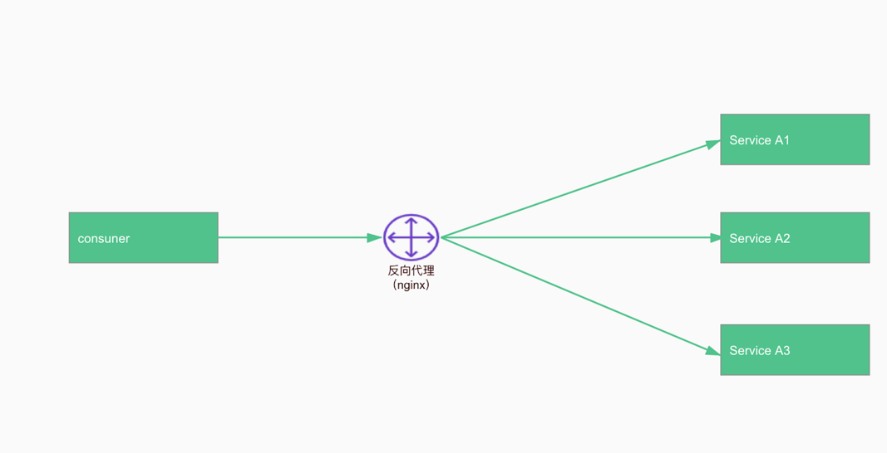

= 系统架构设计

== 核心架构要素
=== 性能
在有可选择的情况下，用户是无法忍受一个响应缓慢的网站的，网站的性能不佳会导致严重的用户流失。

===  可用性
网站宕调、服务不可用是一个重大的事故，轻则影响网站剩余，重则可能会摊上官司，对于电子商务类的网站，网站不可用还会意味着损失金钱和用户。

=== 伸缩性
大型网站需要面对大量用户的高并发访问和存储海量数据，网站需要通过集群的方式将多台服务器组成一个整体共同提供服务。集群路由依赖负载均衡算法来实现。

=== 扩展性
网站增加新的业务产品是否可以对现有的业务无影响。

提升系统扩展性有两种方式：**事件驱动**和**应用分层**。

=== 安全性
CSRF、XSS、sql注入、DDOS流量攻击等，这些常见的系统攻击，应做好预防。

== 分布式架构
=== 网站架构

=== 后端架构演变

==== nginx反向代理

==== 微服务
代表**spring cloud**、*dubbo*

image::微服务.png[]

==== service mesh

== 领域驱动设计

=== DDD领域驱动设计（价值）
* 你获得了一个非常有用的领域模型
* 你的业务得到了更准确的定义和理解
* 领域专家可以为软件的设计做出贡献
* 更好的用户体验
* 清晰的模型边界
* 更好的企业架构
* 敏捷、迭代式和持续建模
* 使用战略和战术新工具

DDD的核心价值在于，我们通过对业务进行整合、建模，抽离出业务中的对象、行为等核心模型，划分业务边界，并给出专业、精准、统一的领域术语，内部对齐。我们可以更流畅的沟通，更好的理解业务。

=== 应用分层
使用DDD建模，传统的三层架构转变成四层架构

== 好的设计

我们在设计时，会谈到模型定义，谈系统规划，那什么样的设计是一个好的系统规划，而不是过度设计。
这里其实并没有一个很明确的分界，如果真的要检验这一结果，得从未来的业务发展来看，但是未来的发展是不确定的。所以，做设计时，我们首先要保证自己的系统扩展性设计是否合理，而系统规划，需要技术、经验、职责、视角
等因素，来帮助你做更好的判断。而职责和视角，恰好跟你的工作内容相关。
